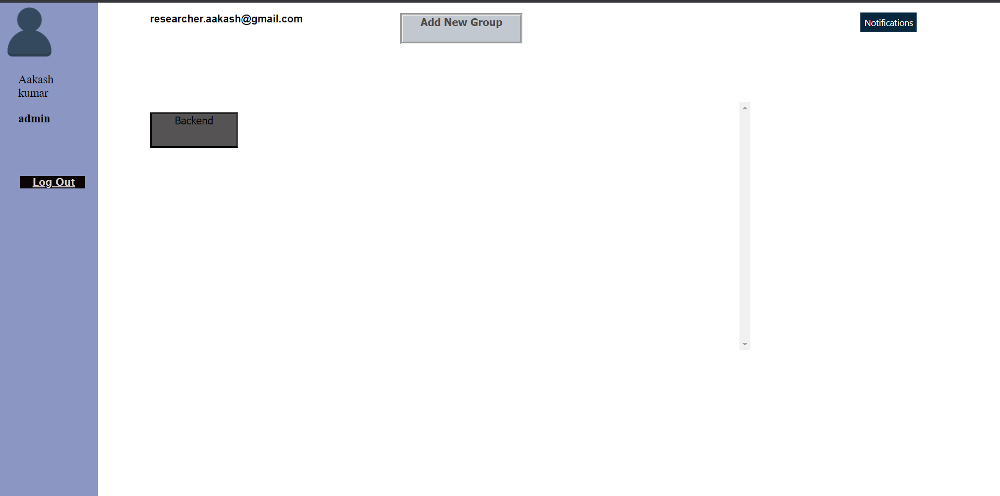
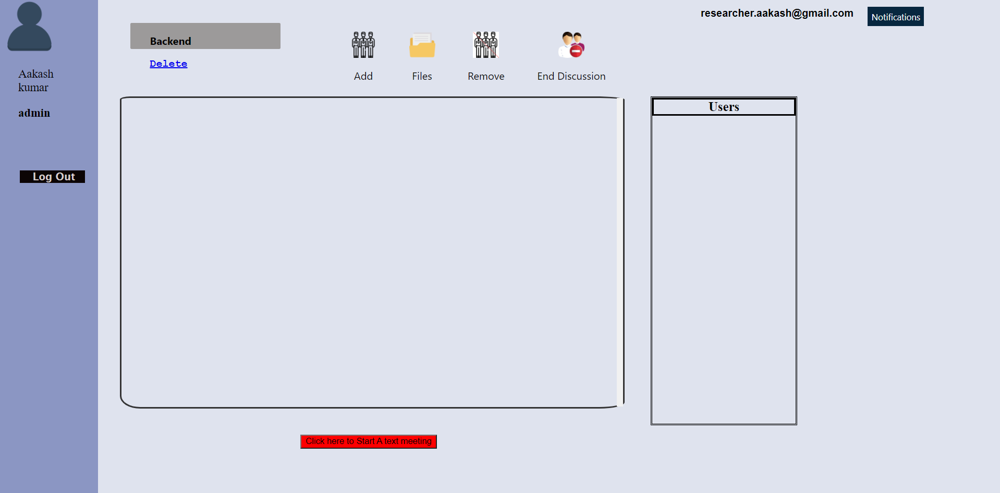

# TeamsApp

A Team Text meeting Application demonstration , built using Nodejs,Mongodb & socket.io

]


## Features
* Create Groups , Organize your company meetings in Groups
* Share files within Groups
* Invite users , Real time Notifications

**Application Flow**

```
* Admin create an Account
* Admin create groups , invite users
* Users signup for users account
* Admin create meeting within a Specific Group
* Notifications for this sent to all members of that particular Group
* remove a member from Group
```

### Includes

- [ExpressJS](https://expressjs.com)
- [NodeJS](https://nodejs.org/en/)
- [Socket.io](https://socket.io/docs)
- [Ejs](https://ejs.co/)
- [mongoose](https://mongoosejs.com/docs/)

Installation
------------
```
 Install [node](http://nodejs.org/#download)
 git clone https://github.com/Aakashk14/TeamSpace
 cd Teamspace
 npm install
 node app.js


